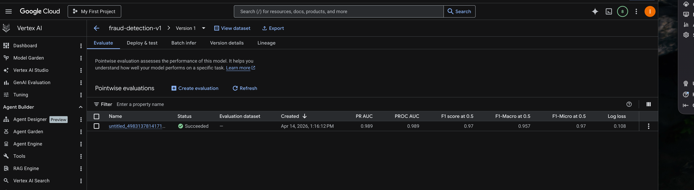
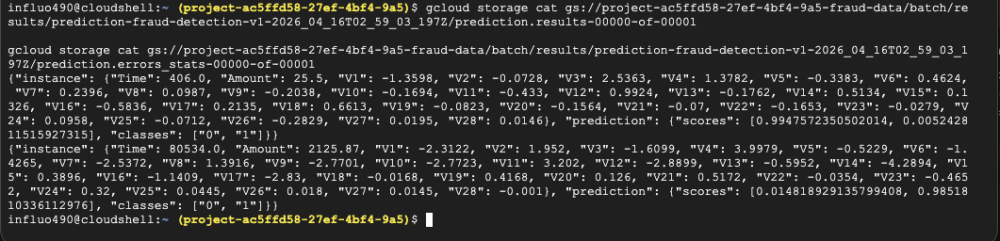
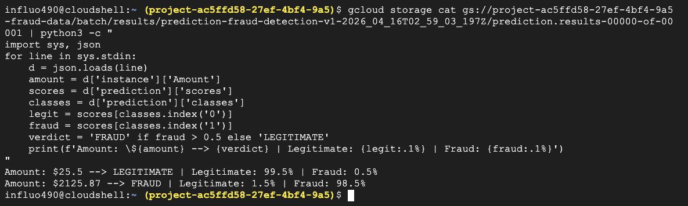

# Fraud Detection API

Real-time mobile money fraud detection using Spring Boot and Google Cloud Vertex AI AutoML.

Built for the GDG Afrique Francophone — Build with AI 2026 conference.

## Architecture

```
Client (POST) → Cloud Run (Spring Boot) → Vertex AI AutoML → Pub/Sub → BigQuery
```

## Tech Stack

| Layer | Technology |
|-------|-----------|
| API | Spring Boot 3.2.2 (Java 17) |
| ML Model | Vertex AI AutoML (tabular classification) |
| Events | Cloud Pub/Sub |
| Audit Log | BigQuery |
| Deployment | Cloud Run (Docker) |

## Project Structure

```
src/main/java/com/gdg/fraud/
├── FraudDetectionApplication.java
├── config/GcpConfig.java          # @EnableAsync
├── controller/FraudController.java
├── dto/
│   ├── TransactionRequest.java    # V1-V28 PCA features
│   └── FraudResponse.java
├── model/PredictionResult.java
└── service/
    ├── VertexAIService.java       # Calls Vertex AI endpoint
    ├── PubSubPublisher.java       # Async event publishing
    └── BigQueryService.java       # Async audit logging
```

## API Endpoints

| Method | Path | Description |
|--------|------|-------------|
| POST | `/api/transactions/verify` | Verify a single transaction |
| POST | `/api/transactions/verify/batch` | Verify multiple transactions |
| GET | `/api/transactions/health` | Health check |

### Request

```json
{
  "transactionId": "TX-001",
  "amount": 25.50,
  "time": 406.0,
  "v1": -1.3598, "v2": -0.0728, "v3": 2.5363,
  "v4": 1.3782, "v5": -0.3383, "v6": 0.4624,
  "v7": 0.2396, "v8": 0.0987, "v9": -0.2038,
  "v10": -0.1694, "v11": -0.4330, "v12": 0.9924,
  "v13": -0.1762, "v14": 0.5134, "v15": 0.1326,
  "v16": -0.5836, "v17": 0.2135, "v18": 0.6613,
  "v19": -0.0823, "v20": -0.1564, "v21": -0.0700,
  "v22": -0.1653, "v23": -0.0279, "v24": 0.0958,
  "v25": -0.0712, "v26": -0.2829, "v27": 0.0195,
  "v28": 0.0146
}
```

### Response

```json
{
  "transactionId": "TX-001",
  "prediction": "LEGITIMATE",
  "confidenceScore": 0.9823,
  "isFraud": false,
  "riskLevel": "LOW",
  "timestamp": "2026-04-14T10:00:00Z",
  "message": "Transaction verified as legitimate. Low risk.",
  "processingTimeMs": 312
}
```

Risk levels: `LOW` (<50%) | `MEDIUM` (50-70%) | `HIGH` (70-90%) | `CRITICAL` (>90%)

## Local Setup

```bash
# Set environment variables
export GCP_PROJECT_ID=fraud-detection-workshop
export GCP_REGION=us-central1
export VERTEX_AI_ENDPOINT_ID=your-endpoint-id
export GOOGLE_APPLICATION_CREDENTIALS=./credentials.json

# Build and run
mvn clean package -DskipTests
mvn spring-boot:run
```

## Docker

```bash
docker build -t fraud-detection-api .
docker run -p 8080:8080 \
  -e GCP_PROJECT_ID=your-project \
  -e GCP_REGION=us-central1 \
  -e VERTEX_AI_ENDPOINT_ID=your-endpoint-id \
  -e GOOGLE_APPLICATION_CREDENTIALS=/app/credentials.json \
  fraud-detection-api
```

## Cloud Run Deployment

```bash
PROJECT_ID=$(gcloud config get-value project)
REGION=us-central1

# Build and push
gcloud auth configure-docker ${REGION}-docker.pkg.dev
docker build -t ${REGION}-docker.pkg.dev/${PROJECT_ID}/fraud-detection/api:v1 .
docker push ${REGION}-docker.pkg.dev/${PROJECT_ID}/fraud-detection/api:v1

# Deploy
gcloud run deploy fraud-detection-api \
  --image=${REGION}-docker.pkg.dev/${PROJECT_ID}/fraud-detection/api:v1 \
  --platform=managed \
  --region=$REGION \
  --allow-unauthenticated \
  --memory=1Gi \
  --cpu=2 \
  --set-env-vars="GCP_PROJECT_ID=${PROJECT_ID},GCP_REGION=${REGION},VERTEX_AI_ENDPOINT_ID=${ENDPOINT_ID}"
```

## Screenshots

### Vertex AI Model Evaluation

Model trained on the credit card fraud dataset. Evaluated on Apr 14, 2026 with strong classification metrics.



| Metric | Value |
|--------|-------|
| PR AUC | 0.989 |
| PROC AUC | 0.989 |
| F1 Score (0.5) | 0.97 |
| F1-Macro (0.5) | 0.957 |
| Log Loss | 0.108 |

### Batch Prediction Results (Raw Output)

Raw JSONL output from Vertex AI batch prediction job, showing per-instance prediction scores for fraud (`"1"`) and legitimate (`"0"`) classes.



### Batch Prediction Results (Parsed)

Parsed prediction output using a Python one-liner — showing amount, verdict, and confidence for each transaction.



```
Amount: $25.5    --> LEGITIMATE | Legitimate: 99.5% | Fraud:  0.5%
Amount: $2125.87 --> FRAUD      | Legitimate:  1.5% | Fraud: 98.5%
```

## Environment Variables

| Variable | Default | Description |
|----------|---------|-------------|
| `GCP_PROJECT_ID` | `fraud-detection-workshop` | GCP project ID |
| `GCP_REGION` | `us-central1` | GCP region |
| `VERTEX_AI_ENDPOINT_ID` | `your-endpoint-id` | Deployed model endpoint |
| `PUBSUB_TOPIC` | `fraud-transactions` | Pub/Sub topic name |
| `BQ_DATASET` | `fraud_detection` | BigQuery dataset |
| `BQ_TABLE` | `prediction_logs` | BigQuery table |
| `PORT` | `8080` | Server port |
